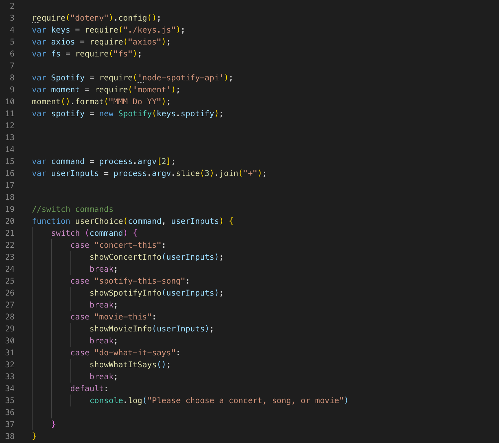
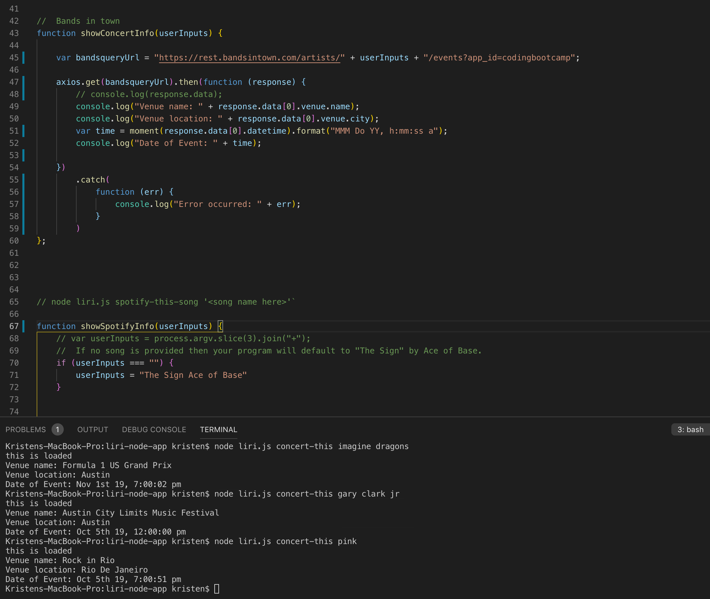
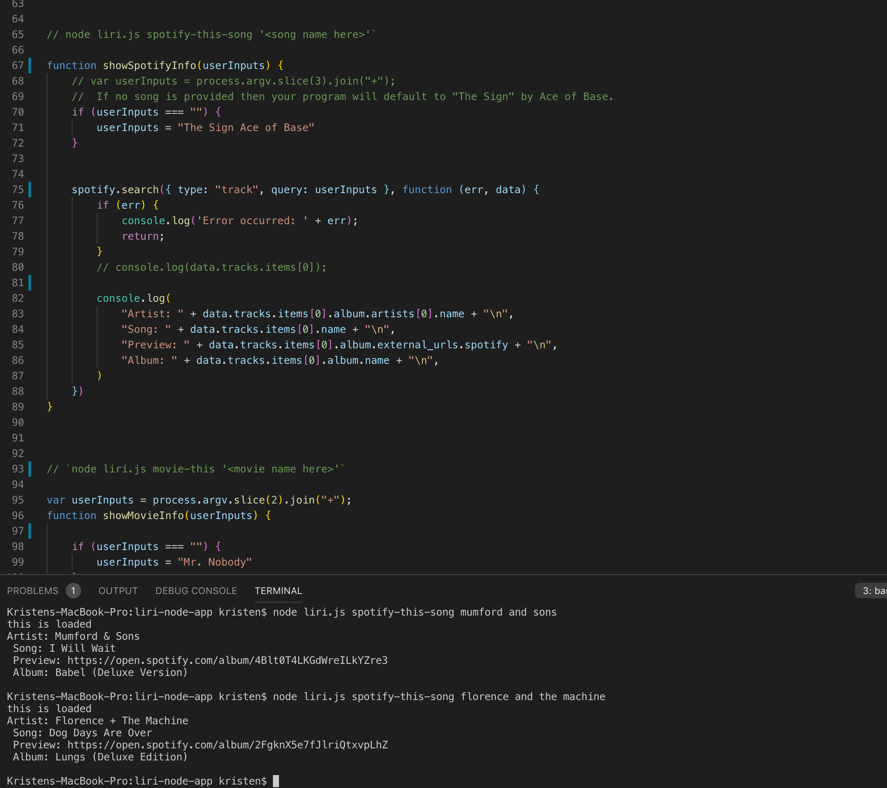
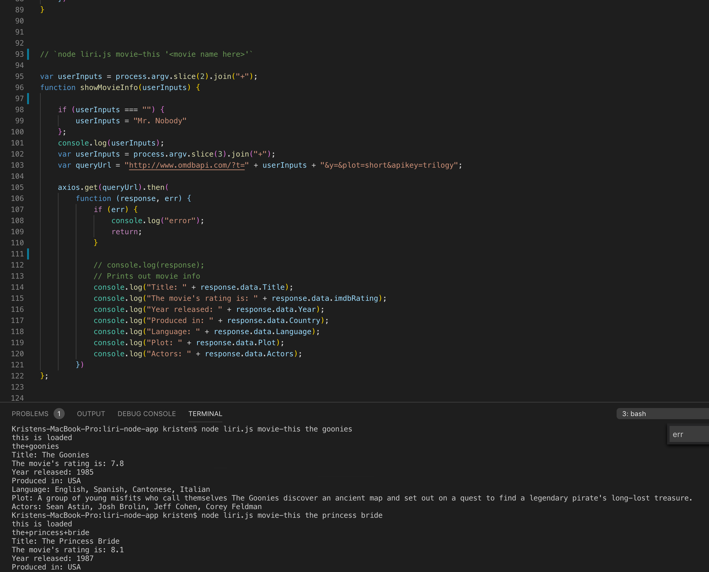
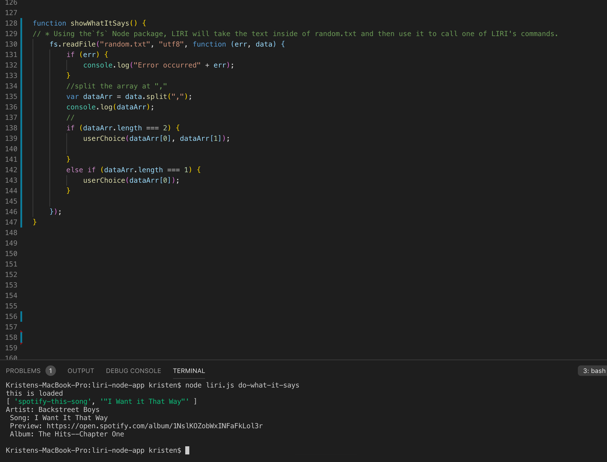
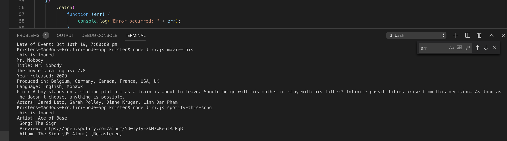

# liri-node-app

Purpose: LIRI is a _Language_ Interpretation and Recognition Interface.  LIRI is a command line node app that takes in parameters and gives you back data.  For the purpose of this project, LIRI will be given inputs that will search Spotify for songs, Bands in Town for concerts, and OMDB for movies.

Organization:
Use Node to run this program. Type node liri.js followed by a command listed below, then add search information

   * `concert-this`

   * `spotify-this-song`

   * `movie-this`

   * `do-what-it-says`

Examples of Searches:
    * node liri.js movie-this the princess bride
    * node liri.js spotify-this-song the dog days are over
    * node liri.js concert-this florence and the machine

For concert-this, you will be  provided with:
 1.  Name of venue
 2.  Venue location
 3.  Date of Event

 

 For spotify-this-song, you will be provided with:
 1. Artist
 2. A preview link of the song from Spotify
 3. The album the song is from
 4. If no song is provided then the program will default to "The Sign" by Ace of Base

 

 For movie-this, you will be provided with:
 1. Title of the movie
 2. Year the movie came out.
 3. IMDB Rating of the movie.
 4. Country where the movie was produced.
 5. Language of the movie
 6. Plot of the movie
 7. Actors in the movie

 
 
 For do-what-it-says, you will be provided with:
 The random.txt file will search for spotify-this-song "I Want it That Way".  You will be provided with the spotify results as listed above.

 

For movie-this, if no userinput is provided, movie-this defaults to Mr. Nobody.  For spotify-this-song, if no song input is provided, the default is The Sign by Ace of Base.

 

Technologies used:
* Javascript
* Node.js
* Bands in Town API
* OMDB API
* Spotify-node-API

